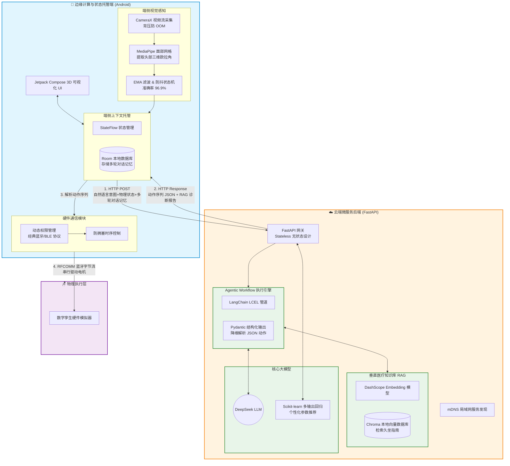

#  基于大模型与云边端协同的智能座椅健康管家 (Android 端)

>  **提示**：本项目为《智能座椅健康管家》的 **Android 移动端/端侧感知部分**。
>  **配套的云端大模型 Agent 与 FastAPI 后端源码请移步至**：https://github.com/Droate/smart-chair-spine-backend

##  项目简介
本项目是针对数字化办公久坐健康痛点研发的 AIoT 全栈系统的移动端部分。主要负责通过手机摄像头进行无接触式的视觉姿态监测，管理多轮对话上下文，并通过蓝牙协议驱动底层硬件设备。

##  核心技术栈
* **UI 框架**: Kotlin, Jetpack Compose, Coroutines
* **视觉算法**: MediaPipe (面部网格与三维欧拉角提取)
* **通信协议**: 经典蓝牙 (RFCOMM), BLE, mDNS
* **其他**: CameraX, Room 数据库

##  核心亮点
* **高精度姿态识别**：弃用传统 2D 方案，基于 MediaPipe 提取头部三维欧拉角，并自主设计 EMA 滤波与防抖状态机，复杂环境识别准确率达 96.9%。
* **极致性能调优**：针对 CameraX 高频视频流设计背压丢帧策略，实现严格的内存闭环回收，杜绝 OOM。
* **端云协同隔离**：配合后端 LangChain 无状态设计，在端侧安全托管多轮对话与设备状态上下文。

